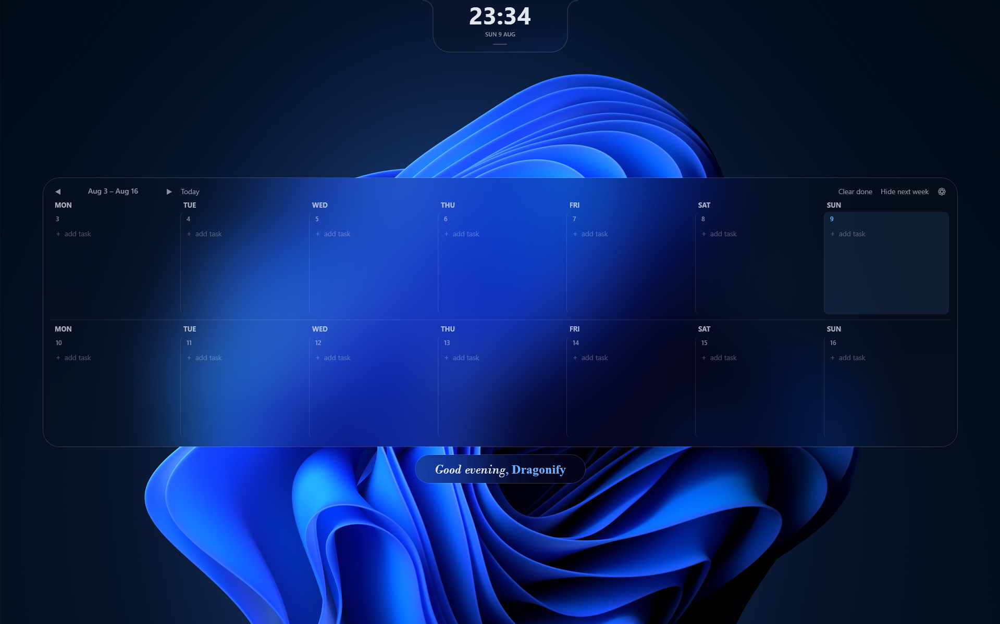

# TodoWall

A two-week to-do board that lives on your desktop — the days of the week across,
one week per block, editable directly from the desktop.



## Build
Needs the **.NET 10 SDK** — the project targets `net10.0-windows`, and the build
script checks for it before doing anything.

```powershell
.\build.ps1 -Run
```

Output lands in `.\dist\TodoWall.exe`. Add `-SelfContained` to bundle the .NET
runtime into a single exe that runs on machines without .NET installed.
## Using it

| Action | How |
|---|---|
| Add a task | Click **+ add task** under any day |
| Add several in a row | Type, press **Enter** — a fresh box opens straight away |
| Complete a task | Click its circle — it fills in, gets a ✓ and a strikethrough |
| Un-complete | Click the filled circle again |
| Edit text | Click the task text |
| Delete | Hover the task and click **✕**, or middle-click it |
| Move to another day | Right-click the task → **Move to** |
| Other weeks | **◀ / ▶** in the top strip; **Today** jumps back |
| Show/hide next week | **Show next week** in the top strip, beside **⚙** |
| Overflowing column | Scroll it — the bottom fades when there's more below |
| Wipe finished tasks | **Clear done** in the top strip |
| Open the calendar | Click the dash under the clock — hover it and it becomes an arrow |
| Jump to a week | Click any day in the calendar |
| Settings | The **⚙** button, right-click the bar or the clock, or the tray icon |
| Uninstall | Settings → **Remove** → *Uninstall TodoWall…* |

Everything saves itself; there is no save button.


## Where your data lives

`%APPDATA%\TodoWall\`

- `board.json` — every week you've ever filled in, keyed by Monday's date.
  Written via a temp file and atomic replace, so a crash mid-save can't shred it.
- `settings.json`
- `todowall.log` — placement and layout breadcrumbs, written only when the state
  changes (desktop hosting fails in ways that are invisible by definition)
- `error.log` — only if something went wrong

Empty weeks older than a year are pruned automatically; weeks with content are
kept forever.

## Memory

Measured on a 1920×1200 single-monitor machine, idle on the desktop:
| Working set | **~12–16 MB** |
| Private (committed) | **~55 MB** |
| Threads | **18** |

If the bar isn't visible, the tray menu's **Bring to front (troubleshoot)** pulls
it to the top of the z-order. If it appears, the window renders fine and only its
stacking is wrong; if it doesn't, the problem is the window itself.

## Notes and limits

- Windows 10/11. Run it **un-elevated** — see above.
- One monitor at a time. The bar spans the working area of the monitor you pick.
- **Move to** relocates a task within its own week only. Between weeks isn't
  supported (unfinished tasks roll forward on their own when the week turns over).
- Text entry happens in a small popup floated over the row, not inline. A window
  living at desktop level takes mouse input fine but cannot reliably own the
  keyboard focus, so typing is delegated to a real top-level window.
